## all-student-name Endpoint
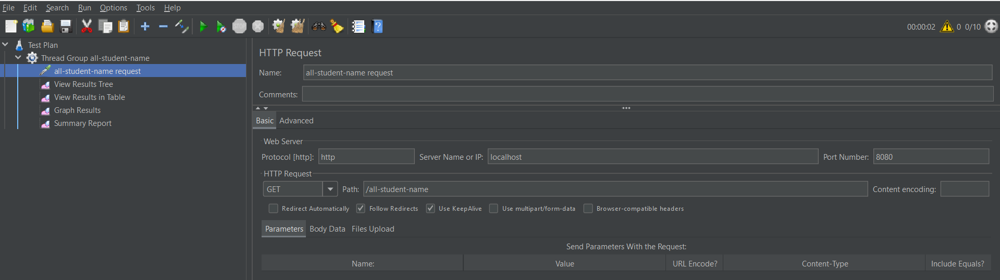

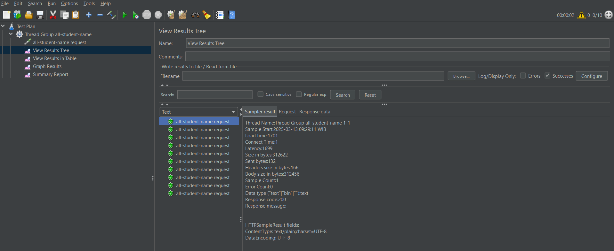

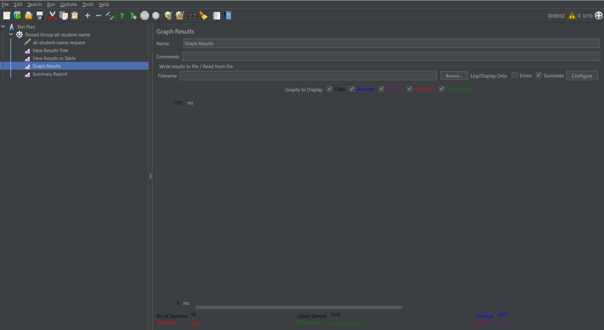

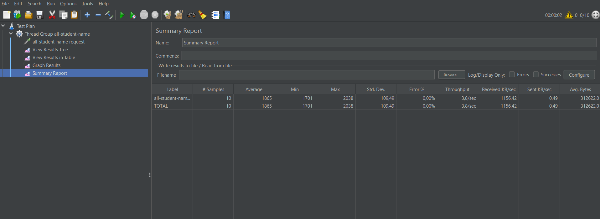

## highest-gpa Endpoint
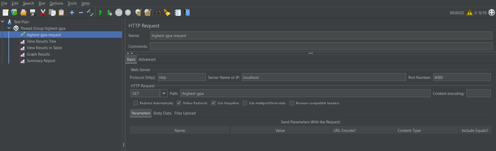

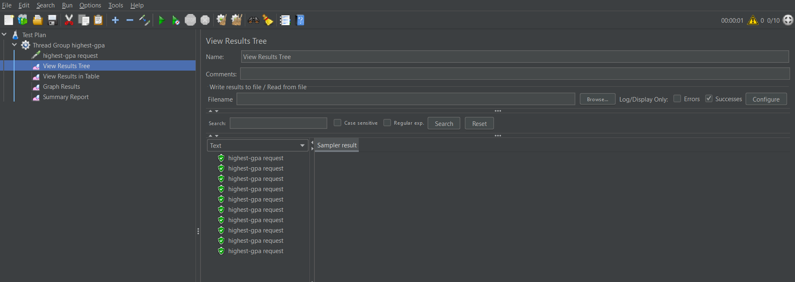

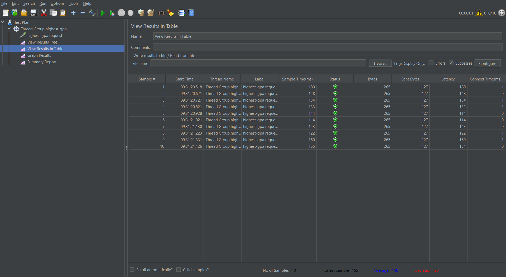

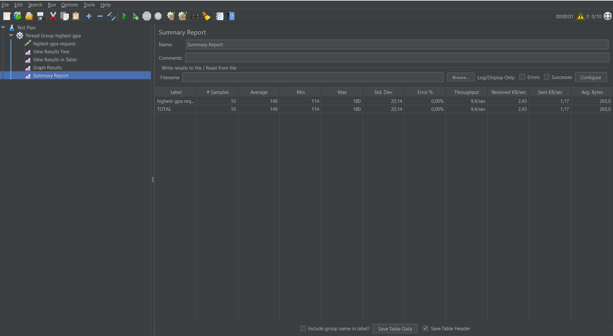

## Result via Command Line
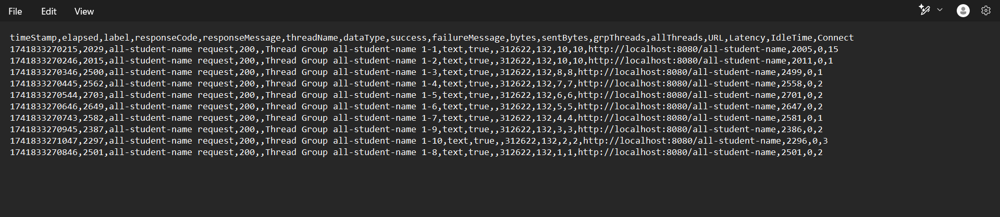

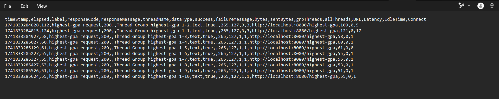

## After Optimization

For all-student request, there is a big improvement from the JMeter measurement. Where the average sample time before optimization was 60735 ms, but after optimization it's average sample time was 4000 ms, which is a huge improvement. 

Before: 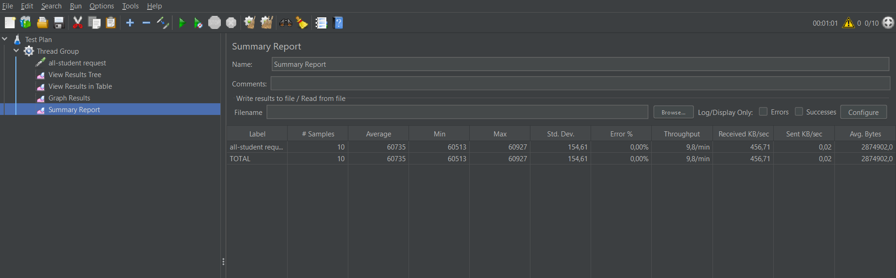

After: 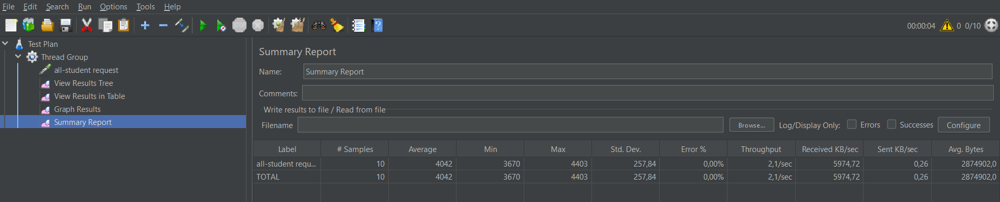

For all-student-name request, there is also quite a significant improvement from the JMeter measurement. Where the average sample time before optimization was 1865 ms, but after optimization it's average sample time was 62 ms, which is a big improvement too.

Before: 

After: 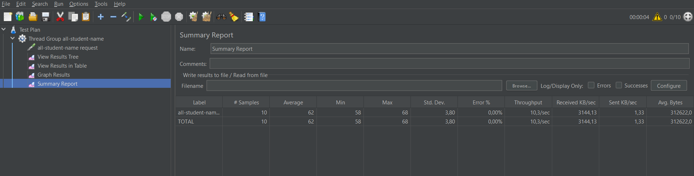

For highest-gpa request, it also shows a little improvement from the JMeter measurement. Where the average sample time before optimization was 140 ms, but after optimization it's average sample time was 111 ms, which is still an improvement.

Before: 

After: 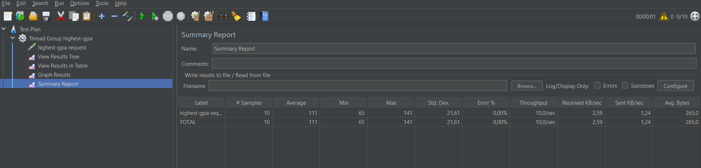

In conclusion, the optimization of the code has shown a significant improvement in the performance of the API. The average sample time has been reduced by a significant amount for all the requests. The optimization has made the API more efficient and faster, which will improve the user experience and make the API more reliable.

## Reflection

1. For JMeter performance testing, it is at the system-level. JMeter simulates user loads  (concurrent scenarios) and measures the performance of the system under different loads. It is a good tool to measure the performance of the system under different loads and identify bottlenecks in the system. On the other hand, Intellij Profiler Profiling will help to identify the performance bottlenecks in the code. It measures CPU usage, memory allocations, method call frequencies, and thread activity to pinpoint exactly which parts of the code are creating bottlenecks. It is a good tool to identify performance bottlenecks in the code and optimize the code for better performance.

2. Profiling process helps me in identifying and understanding the weak points in your application by collecting detailed runtime data. It identifies hot spots, where it will highlight methods that are consuming disproportionate CPU time or memory. It also helps in identifying memory leaks, where it will show objects that are not being garbage collected and are consuming memory.   Profiling process helps in identifying performance bottlenecks in the code and optimizing the code for better performance.

3. Yes, i think that Intellij Profiler is highly effective in assisting me to analyze and identify bottlenecks because it provides detailed runtime data that helps me to pinpoint exactly which parts of the code are creating bottlenecks. It provides information on CPU usage, memory allocations, method call frequencies, and thread activity, which helps me to identify the performance bottlenecks in the code. It also provides visual representations of the data, which makes it easier to understand and analyze the data. Overall, Intellij Profiler is a highly effective tool for analyzing and identifying bottlenecks in the code and optimizing the code for better performance.

4. The most challenging part of the optimization process was identifying and understanding the performance bottlenecks in the code. It was challenging to pinpoint exactly which parts of the code were creating bottlenecks and slowing down the performance of the API. However, with the help of Intellij Profiler, I was able to identify the performance bottlenecks and optimize the code for better performance. It was also challenging to optimize the code without affecting the functionality of the API. I had to make sure that the optimizations did not introduce any bugs or errors in the code. However, with careful testing and debugging, I was able to optimize the code successfully and improve the performance of the API.

5. The main benefits from using Intellij Profiler are that it provides detailed insights into which methods and/or code paths that are taking up most resources. It is also convenient, being integrated into the IDE, which saves time and effort in setting up and running the profiler. Intellij Profiler also has helpful tools like flame graph, call trees, method calls that makes profiling easier and more effective. 

6. In situations where results from profiling with Intellij Profiler are not consistent with performance testing using JMeter, the way to handle it is to analyze the results from both tools and try to identify the reasons for the inconsistency. It could be due to differences in the environment, the load on the system, or the way the tests were conducted. It is important to carefully analyze the results from both tools and try to identify the reasons for the inconsistency. It may also be helpful to run the tests again and compare the results to see if the inconsistency persists. By carefully analyzing the results and identifying the reasons for the inconsistency, it is possible to get a better understanding of the performance of the system and optimize the code for better performance.

7. After analyzing performance test and profiling data, I typically focus on identifying the most resource-intensive “hot spots” in the code and then employ targeted optimizations such as refactoring inefficient algorithms. For this exercise, i only used intuition to make sure the functionality of the application is not affected. However, in a real-world scenario, i would create unit tests and integrate it into the CI/CD pipeline. This automated testing helps verify that any performance improvements are achieved without breaking existing features.